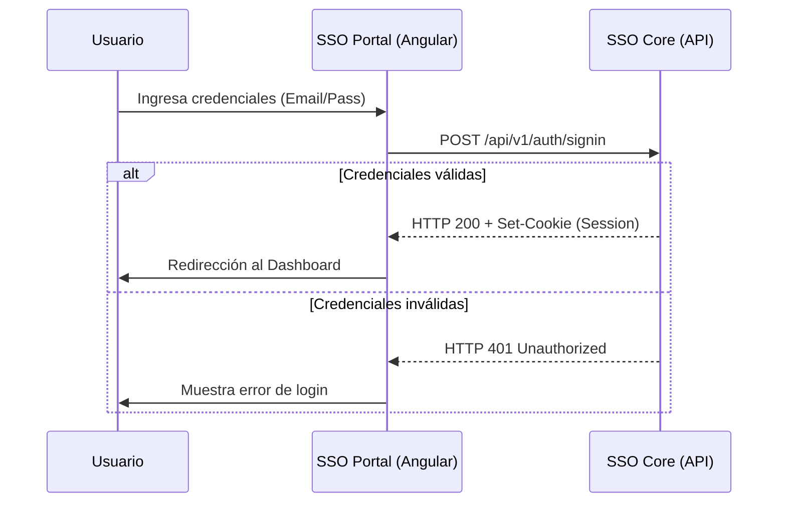

# Architecture — SSO PORTAL

## Visión General
SSO Portal es una Single Page Application (SPA) construida con Angular 18 que sirve como el punto de entrada principal para la autenticación y gestión de usuarios en el ecosistema Bigso.

La aplicación se distribuye como una imagen Docker que contiene los assets estáticos servidos por Nginx. Se comunica exclusivamente con el backend `sso-core` a través de APIs REST seguras.

```mermaid
graph TD
    User[Usuario] -->|HTTPS| Nginx[Nginx Web Server]
    Nginx -->|Sirve| App[Angular SPA]
    App -->|API Calls (JSON)| API[API Gateway / sso-core]
    API -->|Persistencia| DB[(Base de Datos)]
```

## Componentes Principales

### Auth Module
- **Responsabilidad:** Maneja todas las vistas públicas relacionadas con la identidad: Login, Registro, Recuperación de contraseña y Verificación de email.
- **Tecnología:** Angular Modules, Reactive Forms.
- **Ruta:** `/auth/*`

### Dashboard Module
- **Responsabilidad:** Área privada donde los usuarios autenticados gestionan su perfil, sesiones y acceden a las aplicaciones (Tenants) disponibles.
- **Tecnología:** Lazy Loaded Module, Guards de autenticación.
- **Ruta:** `/dashboard/*`

### Core Services
- **Responsabilidad:** Capa de servicios singleton que maneja la comunicación HTTP, el estado de la sesión y la lógica de negocio compartida (ej: `AuthService`).
- **Tecnología:** Angular Services (Injectable root).
- **Ubicación:** `src/app/core/services`

### Shared / UiKit
- **Responsabilidad:** Componentes de interfaz reutilizables (botones, inputs, layouts) estilizados con TailwindCSS.
- **Tecnología:** TailwindCSS, Angular Components.

## Flujos Críticos

### Inicio de Sesión (Sign In)
El flujo más crítico del sistema es la autenticación del usuario.



## Decisiones Técnicas

| Decisión | Alternativas Evaluadas | Razón |
|---|---|---|
| **Angular 18** | React, Vue | Estandarización del equipo Core Team y robustez para validaciones de formularios complejos. Uso de Signals para reactividad. |
| **TailwindCSS** | Bootstrap, SCSS puro | Velocidad de desarrollo y consistencia en el diseño mediante clases utilitarias. |
| **Nginx en Docker** | Node.js Server, Apache | Rendimiento superior para servir archivos estáticos y facilidad de configuración de headers de seguridad. |

## Dependencias Externas

| Servicio | Propósito | SLA/Criticidad |
|---|---|---|
| **sso-core** | Backend principal que provee identidad y datos. | Crítico (Alta disponibilidad requerida) |
| **CapRover** | Plataforma de orquestación para el despliegue. | Medio (Afecta deploys, no runtime si ya está desplegado) |
